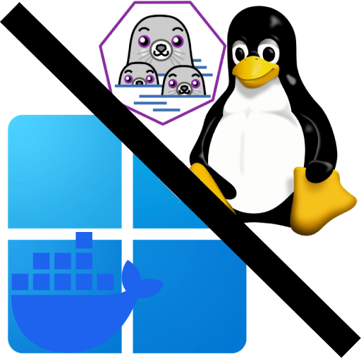

# Crosspose



Crosspose is a Windows-first toolchain for turning Helm/Kubernetes workloads into runnable Docker Compose stacks and orchestrating them side-by-side on Docker Desktop (Windows containers) and Podman in WSL.

## Components
- `src/Crosspose.Dekompose` - CLI that renders Helm charts (or consumes pre-rendered manifests), applies `dekompose.custom-rules`, and emits workload/OS-specific compose files (`docker-compose.<workload>.<os>.yml`).
- `src/Crosspose.Cli` - CLI wrapper that orchestrates docker + podman compose (`crosspose up`, `crosspose compose ...`) and aggregates container status (`crosspose ps -a`).
- `src/Crosspose.Doctor` - CLI checklist (like `flutter doctor`) that inspects prerequisites and can attempt fixes (`--fix`). Additional checks (ACR auth, port proxy, etc.) are persisted in `crosspose.yml` when needed.
- `src/Crosspose.Doctor.Gui` - WPF UI for Doctor that shows check status with per-item Fix buttons.
- `src/Crosspose.Dekompose.Gui` - WPF front-end for Dekompose workflows (chart selection, rendering, output generation).
- `src/Crosspose.Gui` - WPF desktop shell with container dashboard, logs, and tool launchers for Doctor/Dekompose.
- `src/Crosspose.Ui` - Shared WPF controls and styles for the desktop apps.
- `src/Crosspose.Core` - Shared configuration, orchestration, logging, and process runner utilities.

## Quick start
Prefer the GUI:
```powershell
dotnet run --project src/Crosspose.Gui
```

If you prefer CLI:
```powershell
# 1) Check prerequisites
dotnet run --project src/Crosspose.Doctor

# 2) Attempt automatic fixes (winget/wsl where possible)
dotnet run --project src/Crosspose.Doctor -- --fix

# 3) Render a chart (or use --manifest to skip helm) and scaffold outputs
dotnet run --project src/Crosspose.Dekompose -- --chart C:\path\to\chart --values C:\path\to\values.yaml
# or: dotnet run --project src/Crosspose.Dekompose -- --manifest C:\path\to\rendered.yaml --output C:\temp\dekompose-outputs

# 4) Compose orchestration (runs docker compose + podman compose from the same output)
dotnet run --project src/Crosspose.Cli -- compose up --dir C:\temp\dekompose-outputs\my-workload --detach

# 5) View running containers across docker/podman
dotnet run --project src/Crosspose.Cli -- ps -a
```

## Documentation
- [Docs home](docs/index.md)
- [Setup](docs/setup.md)
- [Examples](docs/examples.md)
- [Crosspose](docs/crosspose/index.md)
- [Crosspose.Gui](docs/crosspose.gui/index.md)
- [Crosspose.Dekompose](docs/crosspose.dekompose/index.md)
- [Crosspose.Dekompose.Gui](docs/crosspose.dekompose.gui/index.md)
- [Crosspose.Doctor](docs/crosspose.doctor/index.md)
- [Crosspose.Doctor.Gui](docs/crosspose.doctor.gui/index.md)
- [Crosspose.Core](docs/crosspose.core/index.md)
