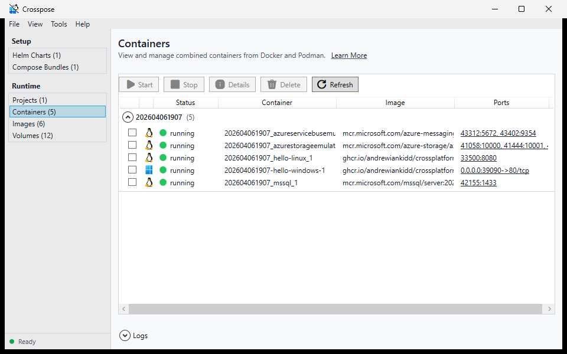

# Crosspose


Crosspose is a Windows-first toolchain for turning Helm/Kubernetes workloads into runnable Docker Compose stacks and orchestrating them side-by-side on Docker Desktop (Windows containers) and Podman in WSL.

## Quick start (GUI)

Open your IDE or terminal as **Administrator**, then:
```powershell
dotnet run --project src/Crosspose.Gui
```

Running elevated lets Doctor auto-configure port proxies and restart services without per-operation UAC prompts.

## Quick start (CLI)

Full worked example using the [cross-platform hello world chart](https://github.com/andrewiankidd/CrossPlatformHelmChartHelloWorld):

```powershell
# 1) Pull the chart from GHCR
helm pull oci://ghcr.io/andrewiankidd/charts/cross-platform-hello --destination .

# 2) Extract the crosspose config bundled inside the chart
tar -xzf cross-platform-hello-0.4.0.tgz cross-platform-hello/crosspose

# 3) Dekompose — converts the Helm chart into OS-split compose files
#    with infrastructure services (MSSQL, Service Bus, Azurite)
dotnet run --project src/Crosspose.Dekompose.Cli -- `
  --chart cross-platform-hello-0.4.0.tgz `
  --values cross-platform-hello/crosspose/values.yaml `
  --dekompose-config cross-platform-hello/crosspose/dekompose.yml `
  --infra --remap-ports --compress

# 4) Deploy the latest bundle to a versioned project directory
dotnet run --project src/Crosspose.Cli -- deploy (Get-ChildItem $env:APPDATA\crosspose\dekompose-outputs\*.zip | Sort-Object LastWriteTime -Descending | Select-Object -First 1).FullName

# 5) Bring it up (use the deployment path from step 4 output)
dotnet run --project src/Crosspose.Cli -- up --dir <deployment-path> -d

# 6) Fix port proxies and other infra (run elevated)
dotnet run --project src/Crosspose.Doctor.Cli -- --fix

# 7) Check container status
dotnet run --project src/Crosspose.Cli -- ps -a
```

Once healthy, open the Linux and Windows container ports shown in `ps` output — each serves an HTML page showing green/red connectivity checks for MSSQL, Service Bus, Azure Storage, and cross-OS peer communication.

## Screenshots

Crosspose GUI with both Linux and Windows hello world containers running and healthy:



Both containers report all four connectivity checks passing — MSSQL, Service Bus, Azure Storage, and cross-OS peer communication via NAT gateway bridging:


## Hello World Demo

The [Cross-Platform Helm Chart Hello World](https://github.com/andrewiankidd/CrossPlatformHelmChartHelloWorld) is a minimal chart designed to prove out all of Crosspose's features:

- **Helm chart conversion** — Deployments + Services split by OS into separate compose files
- **Infrastructure provisioning** — MSSQL, Azure Service Bus Emulator, and Azurite spun up automatically
- **Port proxy bridging** — Windows containers reach Linux services via NAT gateway, Linux containers reach Windows services via WSL host reverse proxy
- **URL remapping** — env vars rewritten with `${NAT_GATEWAY_IP}` and `${WSL_HOST_IP}` for cross-OS communication
- **Healthchecks and autoheal** — Doctor monitors container health and restarts stuck services

Each container serves a status page with green/red indicators for all four checks. When everything passes, both containers report HTTP 200 and show as healthy in the GUI.

## Testing

```powershell
# Unit tests (~170 tests)
dotnet test Crosspose.sln

# Integration test — pulls the hello world chart, dekomposes, deploys,
# and verifies both Linux and Windows containers report healthy
dotnet test src/Crosspose.Integration.Tests --filter Category=Integration
```

## Documentation

See [docs/](docs/) for detailed documentation including setup, configuration, per-project guides, and examples.
