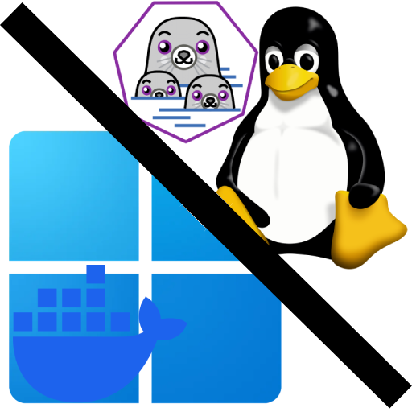

# Crosspose



Crosspose is a Windows-first toolchain for turning Helm/Kubernetes workloads into runnable Docker Compose stacks and orchestrating them side-by-side on Docker Desktop (Windows containers) and Podman in WSL.

## Prerequisites

- Windows 10/11 with Docker Desktop (Windows container mode) and WSL2
- [.NET 10 SDK](https://dotnet.microsoft.com/download)
- [Helm](https://helm.sh/docs/intro/install/)

Run the prerequisite checker to verify your environment:
```powershell
dotnet run --project src/Crosspose.Doctor.Cli
# Fix any issues automatically:
dotnet run --project src/Crosspose.Doctor.Cli -- --fix
```

## Quick start (GUI)

**Run elevated** so Doctor can auto-configure port proxies and restart services without per-operation UAC prompts:
```powershell
Start-Process powershell -Verb RunAs -ArgumentList '-NoExit','-Command','dotnet run --project src/Crosspose.Gui'
```

Without elevation, Crosspose still works but Doctor fixes that need admin (port proxy rules, service restarts) will prompt UAC individually.

## Quick start (CLI)

Full worked example using the [cross-platform hello world chart](https://github.com/andrewiankidd/CrossPlatformHelmChartHelloWorld):

```powershell
# 1) Pull the chart from GHCR
helm pull oci://ghcr.io/andrewiankidd/charts/cross-platform-hello --destination .

# 2) Extract the crosspose config bundled inside the chart
tar -xzf cross-platform-hello-0.3.0.tgz cross-platform-hello/crosspose

# 3) Dekompose — converts the Helm chart into OS-split compose files
#    with infrastructure services (MSSQL, Service Bus, Azurite)
dotnet run --project src/Crosspose.Dekompose.Cli -- `
  --chart cross-platform-hello-0.3.0.tgz `
  --values cross-platform-hello/crosspose/values.yaml `
  --dekompose-config cross-platform-hello/crosspose/dekompose.yml `
  --infra --remap-ports --compress

# 4) Deploy the latest bundle to a versioned project directory
dotnet run --project src/Crosspose.Cli -- deploy (Get-ChildItem $env:APPDATA\crosspose\dekompose-outputs\*.zip | Sort-Object LastWriteTime -Descending | Select-Object -First 1).FullName

# 5) Bring it up (use the deployment path from step 4 output)
dotnet run --project src/Crosspose.Cli -- up --dir <deployment-path> -d

# 6) Fix port proxies and other infra (run elevated)
dotnet run --project src/Crosspose.Doctor.Cli -- --fix

# 7) Check container status
dotnet run --project src/Crosspose.Cli -- ps -a
```

Once healthy, open the Linux and Windows container ports shown in `ps` output — each serves an HTML page showing green/red connectivity checks for MSSQL, Service Bus, Azure Storage, and cross-OS peer communication.

## Components

Libraries hold reusable logic; `.Cli`/`.Gui` projects are thin entry points.

| Project | Purpose |
|---------|---------|
| `Crosspose.Core` | Shared infrastructure: process runner, container runtime abstractions, logging |
| `Crosspose.Dekompose` | Conversion library: renders Helm charts and emits workload-split compose files |
| `Crosspose.Dekompose.Cli` | CLI entry point for Dekompose |
| `Crosspose.Dekompose.Gui` | WPF GUI for chart selection, values editing, and conversion |
| `Crosspose.Cli` | Unified CLI for container ops (`ps`, `up`, `down`, `deploy`, `sources`) |
| `Crosspose.Doctor` | Prerequisite check library (like `flutter doctor`) |
| `Crosspose.Doctor.Cli` | CLI entry point for Doctor. `--fix` attempts automated remediation |
| `Crosspose.Doctor.Gui` | WPF GUI for Doctor with per-item Fix buttons and Fix All |
| `Crosspose.Gui` | Main WPF dashboard: Helm Charts, Compose Bundles, Projects, Containers, Images, Volumes |
| `Crosspose.Ui` | Shared WPF components used by all GUI projects |

## Testing

```powershell
# Unit tests (~170 tests)
dotnet test Crosspose.sln

# Integration test — pulls the hello world chart, dekomposes, deploys,
# and verifies both Linux and Windows containers report healthy
dotnet test src/Crosspose.Integration.Tests --filter Category=Integration
```

## Documentation

See [docs/](docs/) for detailed user-facing documentation.
