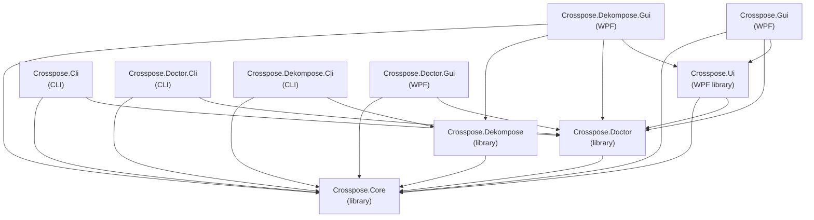

# Crosspose Documentation

Crosspose converts Helm-rendered Kubernetes manifests into Docker Compose stacks and lets you run Windows and Linux containers side-by-side on a single workstation. The toolchain is split into small CLI and WPF apps that share orchestration code so you can script or click through the same flows.

## Why Crosspose?
Assume you are a developer asked to run a complex multi-service system locally. Typical hurdles:
- Sourcing code and assets (clone repos, find manifests, hunt for scripts).
- Machine setup (SDKs, runtimes, CLIs).
- Build steps (stack switching, target frameworks, platform quirks).
- App configuration (env vars, config rewrites, extra processes).
- Dependency setup (email/SMS, SQL, storage, service bus).

Containers help — reproducible runtimes, identical images across dev/test/prod, infra as code — but orchestration gets tricky:
- Kubernetes: Windows images require Windows Server; local k8s variants typically only run Linux images.
- Docker Desktop: can run Windows or Linux mode, not both side-by-side.
- Result: you often cannot run the full workload (win + lin) on one machine; most guidance says it is impossible.

Workaround: run Windows workloads on Docker Desktop (Windows mode) and Linux workloads on Podman inside WSL. Now you can host both kinds of containers together, but expecting every dev/QA to wire Docker + WSL + Podman and juggle shells is a lot.

Crosspose steps in as a cross-platform compose shim for Docker on Windows and Podman in WSL. It brokers commands and presents a unified view, with CLIs and GUIs built on the same core.

## Bridging Windows and Linux containers

### Windows to Linux (NAT gateway)
Windows containers reach Linux services (Podman/WSL) via the Docker nat network gateway. Crosspose.Dekompose.Core rewrites env vars with `${NAT_GATEWAY_IP}` and registers port proxy rules. Doctor configures `netsh interface portproxy` to forward from the NAT gateway to WSL-mapped ports.

### Linux to Windows (WSL host reverse proxy)
Linux containers reach Windows services (Docker Desktop) via the WSL host interface. Crosspose.Dekompose.Core rewrites env vars with `${WSL_HOST_IP}` and registers reverse port proxy rules. The orchestrator resolves the `vEthernet (WSL*)` adapter IP, and Doctor configures Hyper-V and Windows firewall rules to allow the traffic.

Both directions are automated — `crosspose up` applies port proxies, and Doctor fixes anything that needs elevation or firewall rules.

## Architecture

## Projects

| Project | Type | Docs |
|---------|------|------|
| [Crosspose.Core](crosspose.core/README.md) | Library | Shared infrastructure: process runner, container runtime abstractions, NAT/WSL host resolution, port proxy applicator, logging |
| [Crosspose.Doctor.Core](crosspose.doctor.core/README.md) | Library | 21 prerequisite checks with automatic and manual fixes |
| [Crosspose.Dekompose.Core](crosspose.dekompose.core/README.md) | Library | Helm-to-Compose conversion: renders charts, splits by OS, remaps URLs, scaffolds infra |
| [Crosspose.Ui](crosspose.ui/README.md) | WPF library | Shared WPF components used by all GUI projects |
| [Crosspose.Cli](crosspose.cli/README.md) | CLI | Unified CLI: `ps`, `up`, `down`, `deploy`, `sources`, `container`, `images`, `volumes` |
| [Crosspose.Doctor.Cli](crosspose.doctor.cli/README.md) | CLI | `--fix` attempts automated remediation |
| [Crosspose.Dekompose.Cli](crosspose.dekompose.cli/README.md) | CLI | Entry point for Dekompose |
| [Crosspose.Gui](crosspose.gui/README.md) | WPF | Main dashboard: Helm Charts, Compose Bundles, Projects, Containers, Images, Volumes |
| [Crosspose.Doctor.Gui](crosspose.doctor.gui/README.md) | WPF | Per-item Fix buttons, Fix All, offline mode |
| [Crosspose.Dekompose.Gui](crosspose.dekompose.gui/README.md) | WPF | Chart/repo/values selection, runs conversion, manages chart sources |

## Reference

- [Setup guide](setup.md) — prerequisites and installation
- [Configuration](configuration.md) — `crosspose.yml` schema, portable mode
- [Helm chart authoring](helm-chart-authoring.md) — bundling `crosspose/` defaults inside a chart
- [Examples](examples.md) — usage examples

## Next steps
- Run `dotnet run --project src/Crosspose.Doctor.Cli` to check prerequisites.
- Launch the GUI with `dotnet run --project src/Crosspose.Gui`.
- Try the [hello world chart](https://github.com/andrewiankidd/CrossPlatformHelmChartHelloWorld) to see everything in action.
