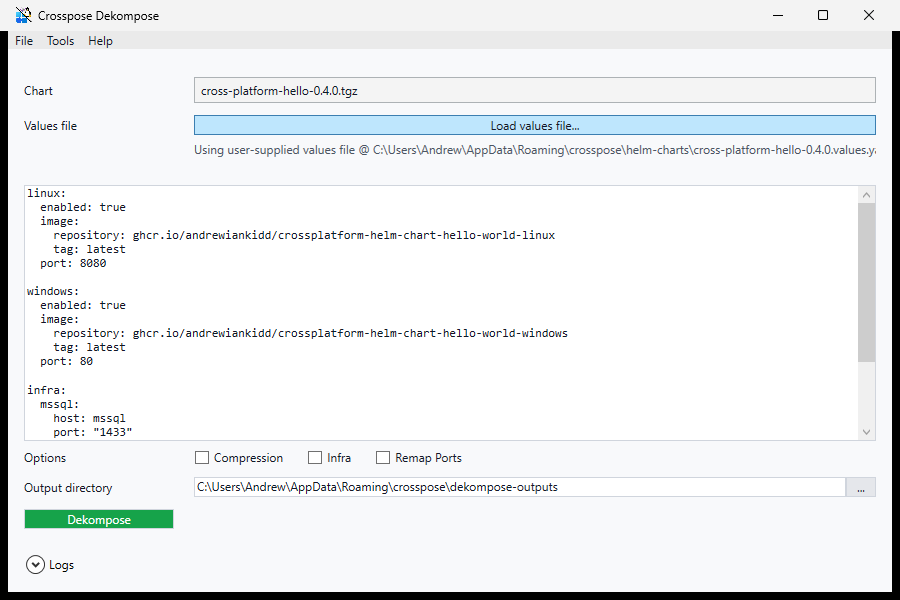

# Crosspose.Dekompose.Gui

This page describes the WPF workflow that wraps Dekompose and how it maps to CLI flags.

## Overview

Crosspose.Dekompose.Gui is a WPF wizard for chart-to-compose conversions. It wraps the same logic as `Crosspose.Dekompose`, but exposes repo selection, values editing, and output options in a single UI.

## Launching with a pre-supplied chart
Pass `--chart <path>` (or `-c <path>`) to open the app with a local chart tgz pre-loaded. The source browsing section is hidden and conversion can start immediately. This is how **Crosspose.Gui > Charts > Dekompose** launches the app.

## Repository selection
On startup (without `--chart`), the app issues `helm repo update` and populates the repo list from `helm repo list -o json`. You can add/remove repos via the shared **Add Chart Source** dialog (from `Crosspose.Ui`), refresh metadata, and pick the source for browsing charts.

## Chart selection
The chart picker uses `helm search repo <repo> -o json` to display available charts and versions. The selected chart determines the default output folder name.

## Values editor
Defaults are loaded from `helm show values <chart> --version <v>`. You can edit in place or import an existing YAML file. The editor validates basic YAML structure before running Dekompose.

## Output and options
The output page maps to CLI flags:

- Output directory -> `--output`
- Chart version -> `--chart-version`
- Compression -> `--compress`
- Infra -> `--infra`
- Remap Ports -> `--remap-ports`

When Infra is enabled, the GUI persists any new Doctor checks (ACR auth, port proxy) into `crosspose.yml` via `DoctorCheckRegistrar`.

## Execution log
The Execution Log panel streams process output from the underlying CLI run. This is the same stdout/stderr you would see in the CLI, captured through `Crosspose.Core.Diagnostics.ProcessRunner`.

## Related docs
- [Crosspose.Dekompose](../crosspose.dekompose/README.md) for output layout and rules.
- [Crosspose.Gui](../crosspose.gui/README.md) for orchestration UI.
