# Crosspose.Gui

This page dives deeper into the WPF shell layout, how it discovers compose bundles, and which commands it issues under the hood.

## Navigation model
The sidebar is split into setup and runtime sections:

- Setup: Charts (local Helm chart tgz files), Compose Bundles (Dekompose outputs).
- Runtime: Projects, Containers, Images, Volumes.

Each view swaps toolbars and data sources based on the selection, so the same window can manage compose inputs and runtime state.

## Charts view

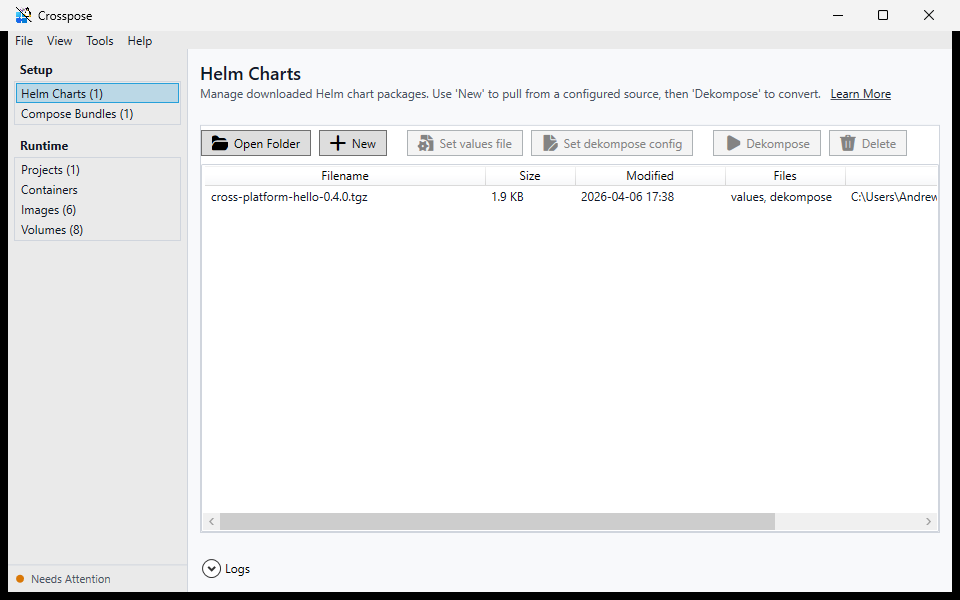

The Charts view browses `{AppData}/helm-charts/` for `.tgz` files. From here you can:
- **Open Folder** — open the directory in Explorer.
- **New** — opens `PickChartWindow` (from `Crosspose.Ui`) to browse chart sources and pull a tgz.
- **Set values file** — associates a `.values.yaml` with the selected chart (copied to the charts directory as `<chartname>.values.yaml`).
- **Set dekompose config** — associates a `.dekompose.yml` with the selected chart (copied as `<chartname>.dekompose.yml`).
- **Dekompose** — launches `Crosspose.Dekompose.Gui.exe --chart <path>` with the selected tgz pre-loaded, passing associated values and dekompose config automatically.
- **Delete** — removes the selected tgz from disk.

## Compose Bundles

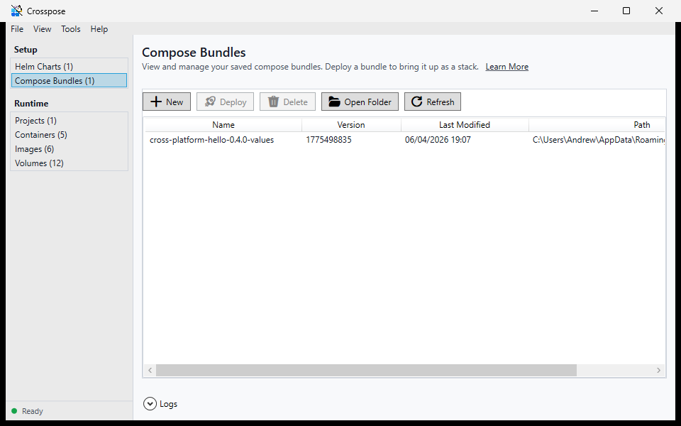

Compose bundles are zip files containing `docker-compose.<workload>.<os>.yml` files produced by Dekompose. When you deploy a bundle, the GUI extracts it into `compose.deployment-directory` and creates a project entry. That project is the unit for future `up`, `down`, `restart`, `logs`, and `ps` actions.

The Compose Bundles toolbar surfaces:
- New (opens Dekompose), Deploy, Delete, Open Folder
- Refresh (reloads bundles from disk)

## Projects view

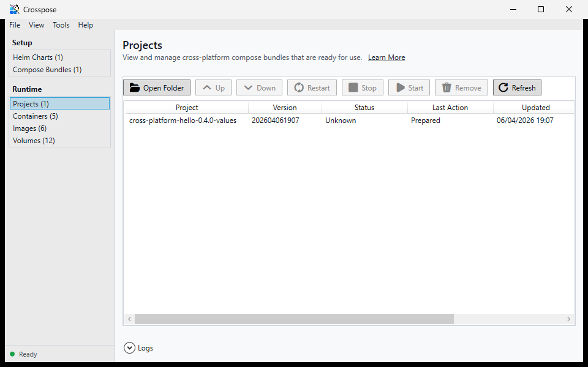

Projects are derived from the deployment folders. Selecting a project enables the compose action buttons (Up, Down, Restart, Stop, Start, Remove). These actions call into `Crosspose.Core.Orchestration.ComposeOrchestrator`, which mirrors the CLI behavior for Docker and Podman.

## Containers view

The containers grid merges Docker and Podman containers into one list. Actions available today:

- Start, Stop, Delete
- Details (opens `ContainerDetailsWindow`)

The details window includes tabs for logs, inspection, bind mounts, exec, files, and stats:

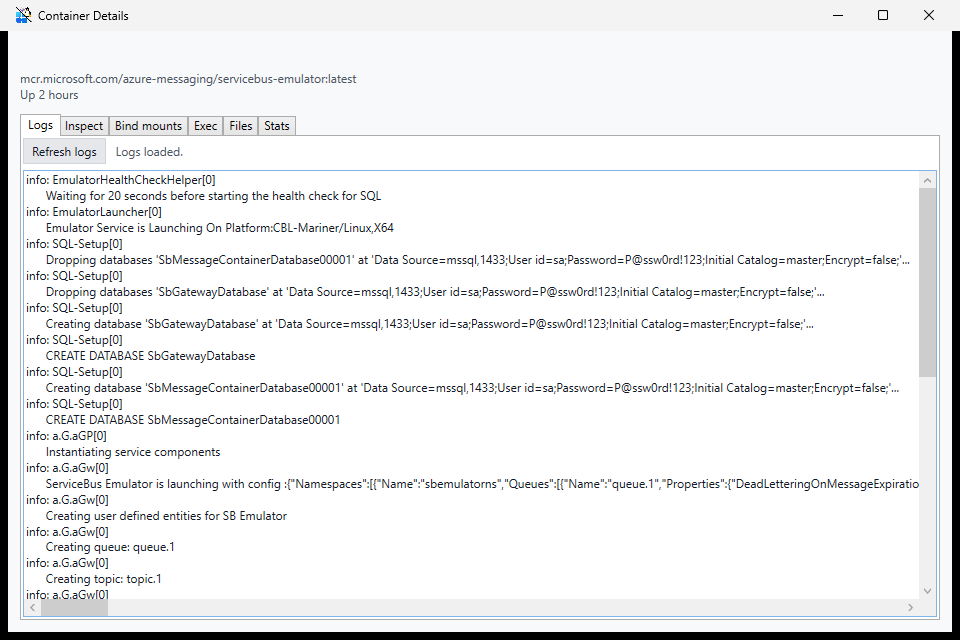

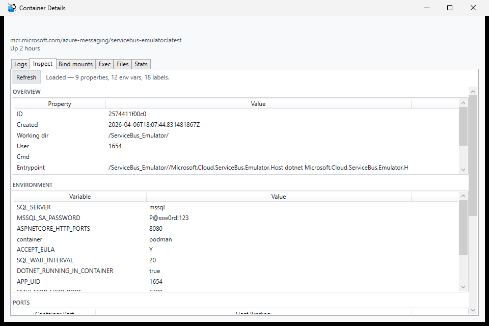

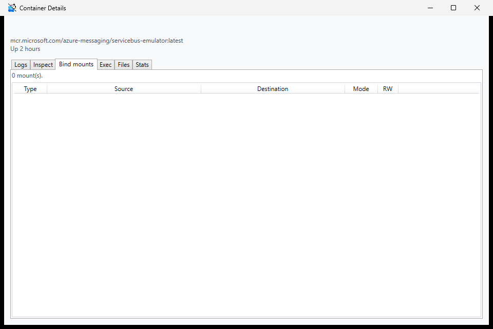

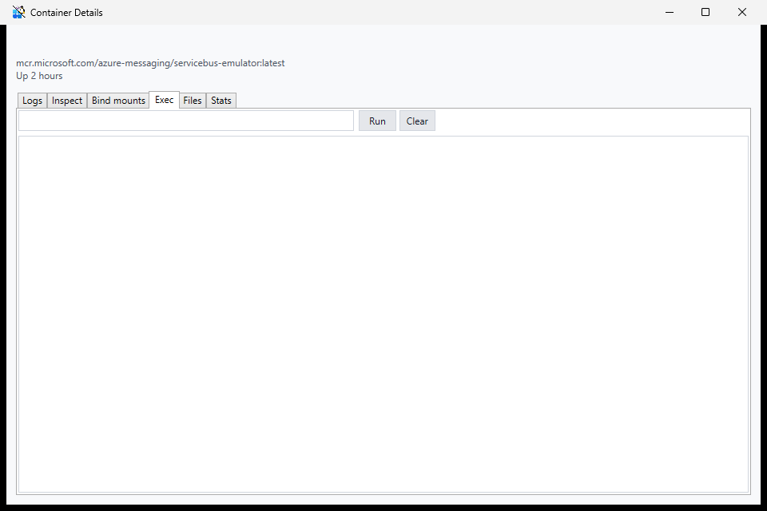

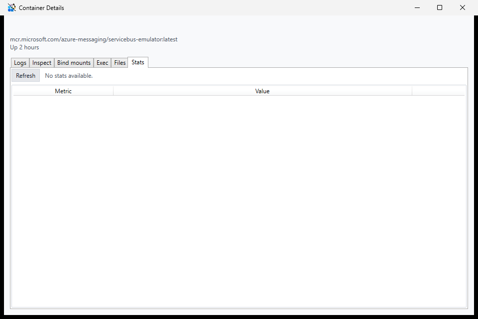

## Images and volumes

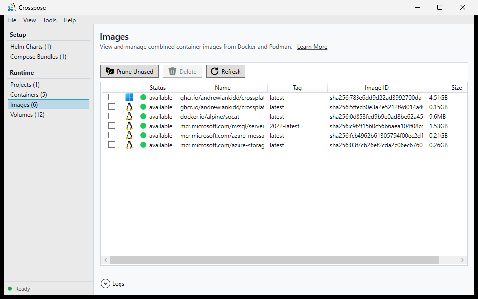

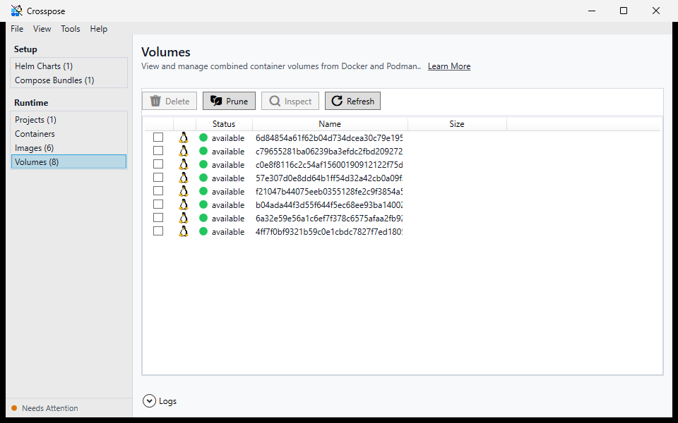

Images and Volumes are surfaced as aggregated lists from Docker and Podman.

- **Images toolbar**: Prune Unused (removes all images not referenced by any container across Docker and Podman), Delete (selected items).
- **Volumes toolbar**: Prune (removes all volumes not referenced by any container), Delete (selected items).

Both prune actions show a confirmation dialog and call the respective `PruneImagesAsync` / `PruneVolumesAsync` on `CombinedContainerPlatformRunner`.

## Tools menu
The Tools menu provides:
- **Crosspose Doctor GUI** — launches Doctor.Gui.
- **Crosspose Dekompose GUI** — launches Dekompose.Gui.
- **Docker Desktop** — launches Docker Desktop.
- **Podman Desktop** — shell execute.
- **Enable/Disable Offline Mode** — suppresses connectivity-requiring Doctor checks; persisted to `crosspose.yml`.
- **Enable Portable Mode** — opens `PortableModeWindow` to migrate data and create a `.portable` marker (only visible in non-portable mode).

## View menu

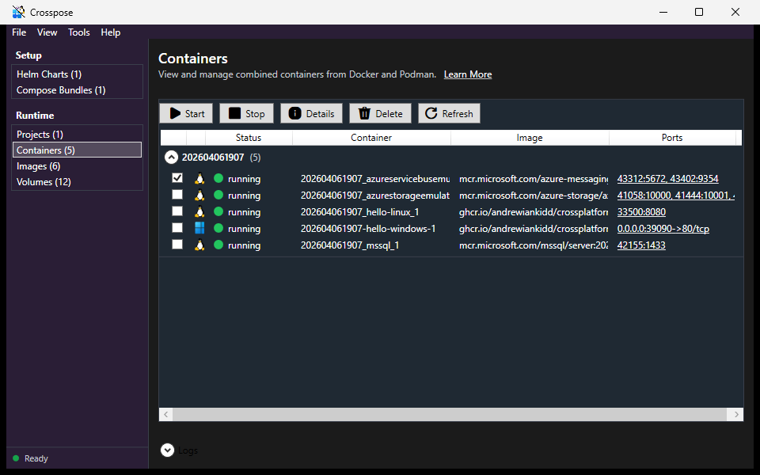

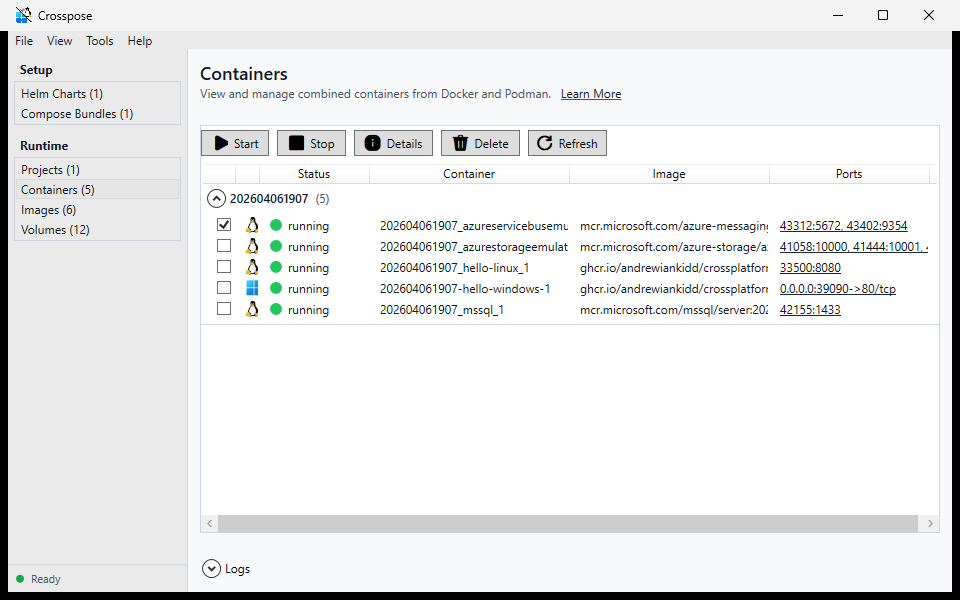

- **Enable Dark Mode / Enable Light Mode** — toggles theme at runtime; persisted to `compose.gui.dark-mode` in `crosspose.yml`.

## Dependencies and configuration
- Uses `Crosspose.Core` for orchestration, logging, and configuration.
- Respects `compose.deployment-directory` and `compose.gui.refresh-interval-seconds` from `crosspose.yml`.

## Related docs
- [Crosspose.Cli](../crosspose.cli/README.md) for orchestration behavior.
- [Crosspose.Dekompose.Gui](../crosspose.dekompose.gui/README.md) for chart-to-compose UI.
- [Crosspose.Doctor.Gui](../crosspose.doctor.gui/README.md) for prerequisite checks.
