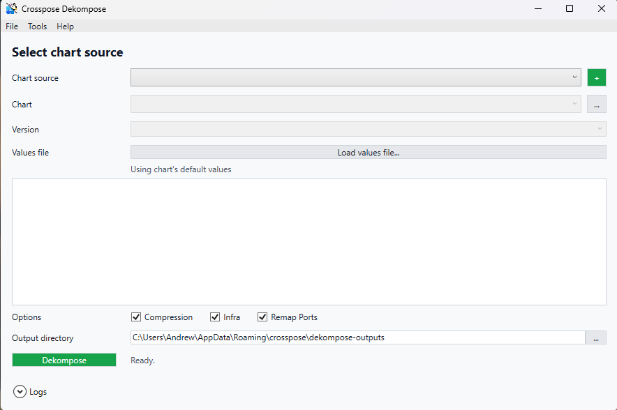

# Crosspose.Dekompose.Gui

Simple WPF front-end for Crosspose Dekompose.



## Current state
- Guided workflow for selecting a compose source and reviewing generated artifacts.
- Uses shared orchestration and conversion logic from `src/Crosspose.Dekompose` and `src/Crosspose.Core`.

## Usage
```powershell
dotnet run --project src/Crosspose.Dekompose.Gui

# Alternate: run CLI dekompose for headless environments
dotnet run --project src/Crosspose.Dekompose
```
