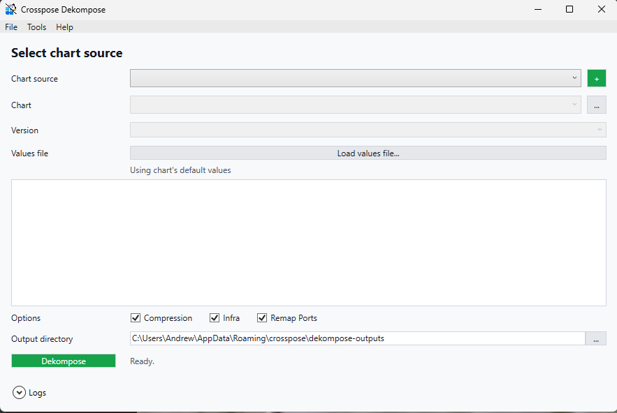

# Crosspose.Doctor.Gui

Simple WPF front-end for Crosspose Doctor. It lists each prerequisite check (docker compose, WSL, Helm) with status and a Fix button. The Fix button is disabled for successful checks and runs the same remediation steps as the CLI when clicked.



## Current state
- Auto-runs all checks on load and updates status inline.
- Uses the shared `ICheckFix` implementations from `src/Crosspose.Doctor`.

## Usage
```powershell
dotnet run --project src/Crosspose.Doctor.Gui

# Alternate: run CLI doctor for headless environments
dotnet run --project src/Crosspose.Doctor -- --fix
```
