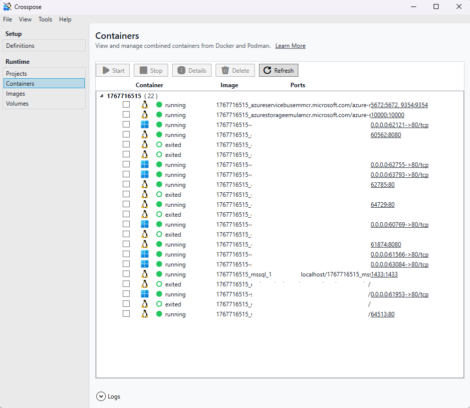

# Crosspose GUI

This project is the main WPF desktop shell for Crosspose. It provides a container dashboard, log view, and entry points into the Doctor and Dekompose tooling while reusing orchestration logic from `Crosspose.Core` and `Crosspose.Cli`.

## Current state
- WPF UI with container list, log view, and tool launchers.
- Uses shared UI primitives from `src/Crosspose.Ui`.

## Next steps
- Expand workflow shortcuts (start/stop/restart per workload).
- Surface output locations and port mappings emitted by Dekompose.
